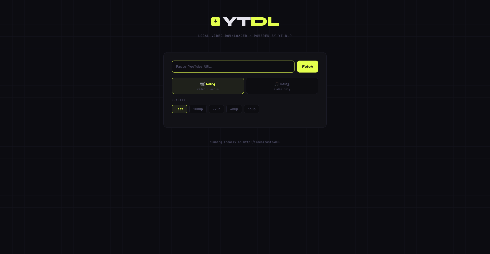

# YTDL — Local YouTube Downloader

A simple local web app that lets you download YouTube videos (or audio) through your browser.  
Paste a URL, pick MP4 or MP3, choose quality, hit download. That's it.



---

> ⚠️ **Legal Disclaimer**
>
> This project is a **personal, educational experiment** built for learning purposes only.
>
> The author does **not** encourage, promote, or condone the downloading of any content that violates YouTube's [Terms of Service](https://www.youtube.com/t/terms), any platform's usage policies, or applicable copyright laws. Downloading copyrighted content without the explicit permission of the rights holder may be illegal in your country.
>
> **You are solely responsible** for how you use this tool. The author accepts no liability for any misuse, legal consequences, or damages arising from the use of this software. This tool is intended only for content you own, content in the public domain, or content explicitly licensed for download.
>
> Use responsibly and at your own risk.

---

## How It Works

The app has two parts that talk to each other:

**Backend — `server.js` (Node.js)**  
A small web server that runs on your machine. When you paste a URL and hit Fetch, the browser asks the server for video info. When you hit Download, the server launches `yt-dlp` (a command-line tool) as a background process, streams the progress back to your browser in real time using a technology called Server-Sent Events (SSE), and saves the finished file to your `~/Downloads` folder.

**Frontend — `public/index.html` (HTML/CSS/JS)**  
A single-page web interface served by the backend. It handles the URL input, format selection (MP4 or MP3), quality selection, thumbnail preview, and the live progress bar. It never talks to YouTube directly — everything goes through the local server.

```
You (Browser)  ──→  localhost:3000  ──→  yt-dlp  ──→  YouTube
                         ↑
                    server.js
```

**MP4 mode** downloads the best video + audio streams separately and merges them into a single `.mp4` file using ffmpeg.

**MP3 mode** skips the video entirely, downloads only the audio stream, and converts it to a high-quality `.mp3` using ffmpeg.

---

## Requirements

- **Node.js** v18 or newer (includes npm)
- **yt-dlp** installed
- **ffmpeg** (needed to merge video + audio, and to convert audio to mp3)
- **Google Chrome** (used for cookie authentication — helps avoid 403 errors from YouTube)

---

## Installation

### macOS

```bash
# 1. Install Homebrew (if you don't have it)
/bin/bash -c "$(curl -fsSL https://raw.githubusercontent.com/Homebrew/install/HEAD/install.sh)"

# 2. Install Node.js (includes npm), yt-dlp, and ffmpeg
brew install node yt-dlp ffmpeg

# 3. Verify everything installed correctly
node --version   # should show v18 or higher
npm --version    # should show a version number
yt-dlp --version
ffmpeg -version
```

---

### Windows

**1. Install Node.js (includes npm)**  
Download and run the installer from https://nodejs.org — choose the LTS version.  
After installing, open a new terminal (Command Prompt or PowerShell) and verify:
```powershell
node --version
npm --version
```

**2. Install yt-dlp**
```powershell
winget install yt-dlp
```
Or download `yt-dlp.exe` manually from https://github.com/yt-dlp/yt-dlp/releases and place it somewhere on your PATH (e.g. `C:\Windows\System32`).

**3. Install ffmpeg**
```powershell
winget install ffmpeg
```
Or via Chocolatey: `choco install ffmpeg`

**4. Verify**
```powershell
yt-dlp --version
ffmpeg -version
```

---

### Linux (Ubuntu / Debian)

```bash
# 1. Install Node.js (includes npm)
curl -fsSL https://deb.nodesource.com/setup_20.x | sudo -E bash -
sudo apt install -y nodejs

# Verify
node --version
npm --version

# 2. Install yt-dlp
sudo curl -L https://github.com/yt-dlp/yt-dlp/releases/latest/download/yt-dlp \
  -o /usr/local/bin/yt-dlp
sudo chmod a+rx /usr/local/bin/yt-dlp

# 3. Install ffmpeg
sudo apt install -y ffmpeg

# 4. Verify everything
yt-dlp --version
ffmpeg -version
```

---

## Running the App

```bash
# 1. Go into the project folder
cd ytdl-app

# 2. Install Node dependencies — only needed the first time
#    This reads package.json and installs Express into a local node_modules folder
npm install

# 3. Start the server
node server.js

# 4. Open your browser and go to:
#    http://localhost:3000
```

On macOS you can also just run:
```bash
open http://localhost:3000
```

To stop the server at any time, press `Ctrl + C` in the terminal.

---

## Folder Structure

```
ytdl-app/
├── server.js        ← Node.js backend
├── package.json     ← project config & dependencies
└── public/
    └── index.html   ← browser UI (must be inside "public"!)
```

---

## Format & Quality Options

**Format**

| Option | What you get                          |
|--------|---------------------------------------|
| MP4    | Video + audio merged into one file    |
| MP3    | Audio only, best quality VBR encoding |

**Quality** (MP4 only — MP3 always uses the best available audio)

| Label  | What you get                        |
|--------|-------------------------------------|
| Best   | Highest available (4K if available) |
| 1080p  | Full HD, capped at 1080p            |
| 720p   | HD, smaller file size               |
| 480p   | Standard definition                 |
| 360p   | Low quality, very small file        |

All downloads are saved to your `~/Downloads` folder (or `C:\Users\<you>\Downloads` on Windows).

---

## Troubleshooting

**"Sign in to confirm you're not a bot" / all browsers fail**  
The app automatically tries every browser installed on your computer (Safari, Chrome, Firefox, Brave, Edge…). If every single one fails, the app will show a **"We tried everything"** screen with step-by-step instructions:

1. Install the **[Get cookies.txt LOCALLY](https://chromewebstore.google.com/detail/get-cookiestxt-locally/cclelndahbckbenkjhflpdbgdldlbecc)** extension in Chrome or Firefox (free, 30 seconds)
2. Go to [youtube.com](https://youtube.com) while **logged in** → click the extension → click **Export** → save the file
3. **Drag & drop** (or click to upload) the `cookies.txt` file directly into the app

The app will save the file and automatically retry the download. From that point on it will always use the cookie file — you won't need to do this again unless your session expires.

**403 Forbidden errors**  
The app automatically tries cookies from all your installed browsers. If you're still getting 403s, make sure you're logged into YouTube in at least one browser and try again. See the bot detection fix above.

**`Cannot GET /`**  
Make sure `index.html` is inside the `public/` subfolder, not loose in the root folder.

**`npm: command not found`**  
npm comes bundled with Node.js — re-run the Node.js installation steps above. After installing, restart your terminal.

**`yt-dlp: command not found`**  
yt-dlp isn't on your PATH. Re-run the install steps above or restart your terminal after installing.

**`ffmpeg not found`**  
ffmpeg is required both for merging MP4 streams and for converting to MP3. Install it using the steps above.

**MP3 conversion is slow**  
That's normal — ffmpeg is re-encoding the audio stream. It usually takes 10–30 seconds after the download finishes.

---

## Tech Stack

- [yt-dlp](https://github.com/yt-dlp/yt-dlp) — the download engine
- [Express](https://expressjs.com/) — minimal Node.js web server
- [Server-Sent Events](https://developer.mozilla.org/en-US/docs/Web/API/Server-sent_events) — real-time progress streaming
- Vanilla HTML/CSS/JS — no frameworks, no build step

---

*Built for fun and learning. Not affiliated with YouTube or Google.*